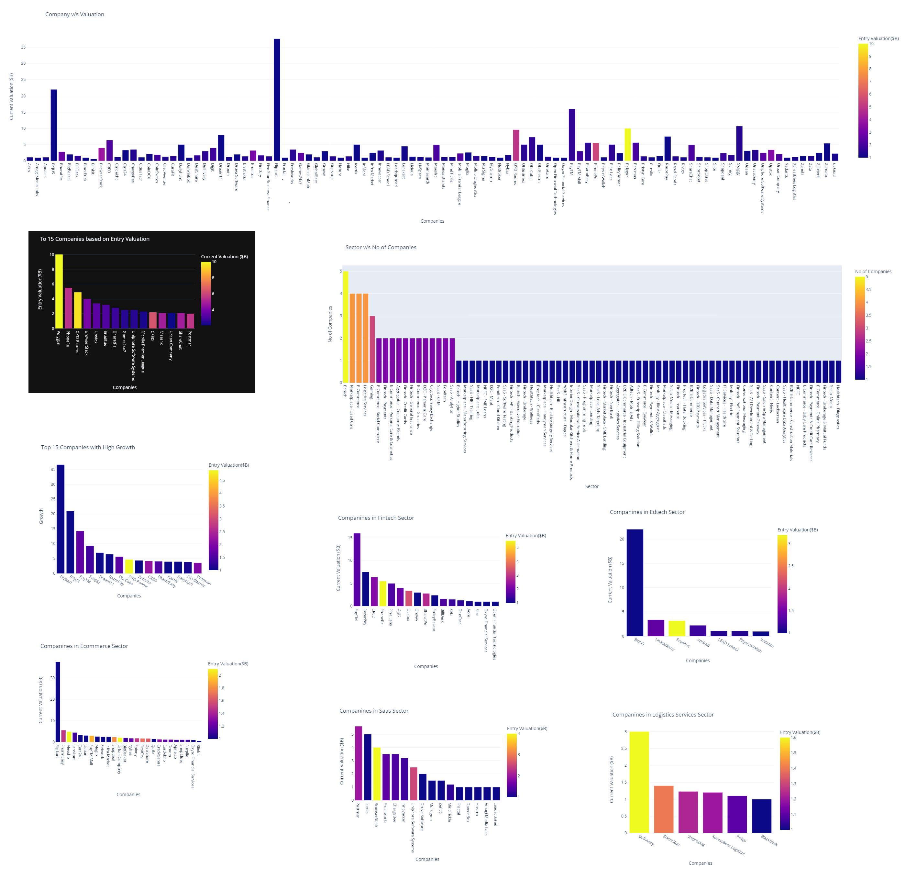

# Unicorns of India till Sep 2022 Analysis (EDA)
This ipython notebook is the <b>Exploratory data analysis (EDA)</b> of the <b>Unicorns of India till Sep 2022</b>. The dataset used has been compiled from a source through web scrapping. This dataset consist of list of all unicorns in India till Sep 2022. 
You can follow the analysis on <a href="https://www.kaggle.com/code/shrikrishnaparab/unicorns-of-india-till-sep-2022-analysis-eda">kaggle</a>

## Packeges Used:
 ![Python][python] ![NumPy][numpy-image] ![Pandas][Pandas-image] ![Matplotlib][Matplotlib-image] ![Plotly][Plotly-image]  ![Jupyter Notebook][ipython-image]
 
[python]: https://img.shields.io/badge/python-3670A0?style=for-the-badge&logo=python&logoColor=ffdd54
[numpy-image]: https://img.shields.io/badge/numpy-%23013243.svg?style=for-the-badge&logo=numpy&logoColor=white
[Pandas-image]: https://img.shields.io/badge/pandas-%23150458.svg?style=for-the-badge&logo=pandas&logoColor=white
[Matplotlib-image]: https://img.shields.io/badge/Matplotlib-%23ffffff.svg?style=for-the-badge&logo=Matplotlib&logoColor=black
[Plotly-image]: https://img.shields.io/badge/Plotly-%233F4F75.svg?style=for-the-badge&logo=plotly&logoColor=white
[ipython-image]: https://img.shields.io/badge/jupyter-%23FA0F00.svg?style=for-the-badge&logo=jupyter&logoColor=white

# What is Exploratory Data Analysis?
Exploratory Data Analysis (EDA) is a technique used to gain insights and understanding from a given dataset. It is an approach for analyzing and summarizing data that allows analysts to identify patterns, trends, and relationships within the data. EDA is typically the first step in the data analysis process and also is an iterative process that involves visualizing and summarizing the data in various ways.

The main goal of EDA is to develop a deeper understanding of the data and identify any potential issue or limitation. This process allows analysts to clean and prepare the data for further analysis, and can also reveal insights that can guide the analysis to move in a proper direction.

One of the key tools used in EDA is visualization. Visualizing data in various ways can reveal patterns and relationships that may not be immediately apparent when looking at raw data.  
Common visualizations used in EDA include:
  1. Histograms
  2. Scatter plots
  3. Box Plots
  4. Bar Charts
  5. Line Charts
  6. Pie Chart or Donut Chart
  7. Bubble Charts  
These visualizations can be used to identify outliers, patterns, and trends in the data, and can also be used to compare different subsets of the data.

Another important aspect of EDA is summarizing the data using statistical measures such as mean, median, standard deviation nd plotting the Corelation Matrix. These measures can be used to understand the distribution of the data and identify any potential outliers.

EDA can also include data cleaning and preprocessing, which is the process of identifying and correcting errors or inconsistencies in the data. This can include handling missing data, removing outliers, or transforming variables to make the data more suitable for analysis.

Overall, EDA is a crucial step in the data analysis process, as it allows analysts to gain a deeper understanding of the data and identify any potential issues or limitations before proceeding with more advanced analysis. It also can also be a great way to find the insights that can guide the further analysis.

## Unicorns of India:
Unicorns are startup companies that have achieved a valuation of $1 billion or more. They are considered rare and highly valuable, similar to the mythical creature they are named after.  
India is home to a number of unicorn startups, including:
    - Flipkart: An e-commerce company founded in 2007, Flipkart is considered the pioneer of the Indian e-commerce industry. It was valued at over $1 billion in 2014.
    - Paytm: A digital payments company founded in 2010, Paytm became a unicorn in 2015.
    - Ola: A ride-hailing company founded in 2010, Ola achieved unicorn status in 2014.
    - Quikr: An online classifieds platform founded in 2008, Quikr became a unicorn in 2014.
    - OYO: A hotel booking platform founded in 2013, OYO became a unicorn in 2015.
    - Byju's: An edtech company founded in 2011, Byju's became a unicorn in 2016.
    - PolicyBazaar: An insurtech company founded in 2008, PolicyBazaar became a unicorn in 2018.
    - Udaan: A B2B e-commerce platform founded in 2016, Udaan became a unicorn in 2018.
    - ReNew Power: A renewable energy company founded in 2011, ReNew Power became a unicorn in 2019.
    - Postman: A collaboration platform for API development founded in 2014, Postman became a unicorn in 2020

## The Task:
The task was to analyze the Unicorns of India data and answer some key questionas like, unicors and their individual valuations, top 15 companies, companies which lost their unicorn status, and so on. 

## The Process:

## About Data:
This data set gives information about the unicorns which lost their unicorn status in India and information about the publicly listed company status. This data was scrapped from https://www.ventureintelligence.com/. Dataset has 10 columns and 102 rows. 
    Columns:
    1. No (sr. no)
    2. Company (Company Name)
    3. Sector (Sector of the company sep by -)
    4. Publicly Listed (Is company Publicly Listed (0,1))
    5. Entry Valuation($B) (Valuation in $B when entering the list of Unicorns)
    6. Valuation ($B) ( Current Valuation in $B)
    7. Entry (date of entry)
    8. Former Unicorn ( has company lost its unicorn status (0,1))
    9. Location 
    10. Investors (list of investors sep by ,)
The Dataset(CSV) does not have any null data and has no duplicate entry. 

## EDA (Data Analysis Results):
Please Go thorugh the ipython file for more in detail analysis, below are some key Details. 

